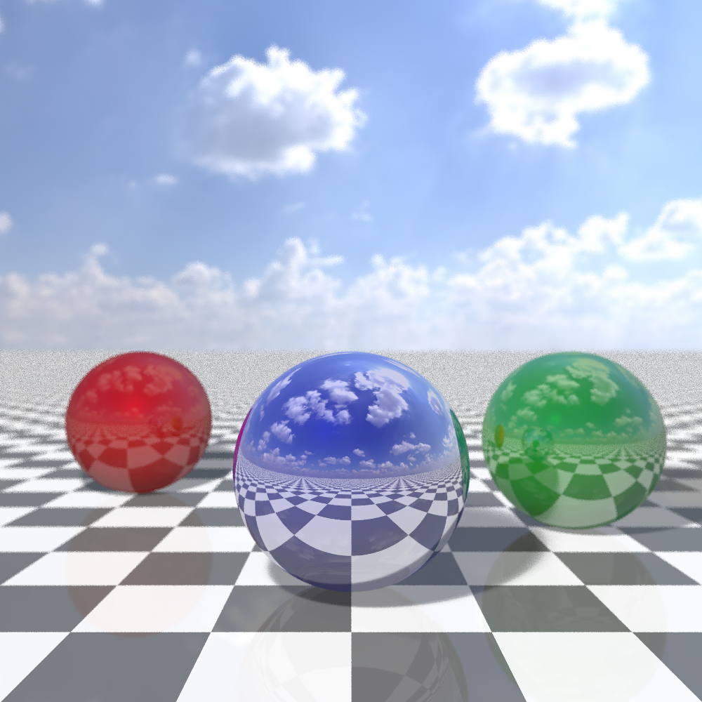

# PythonRay Tracer

A Python-based ray tracer that creates photorealistic images of 3D scenes with materials, reflections, refraction, and lighting effects.



## Features

- **Realistic Materials**: Glass, plastic, and metallic surfaces
- **Reflections**: Mirror-like reflections with proper color and intensity
- **Transparency**: Glass with refraction and Fresnel effects
- **Advanced Lighting**: Phong shading model with ambient, diffuse, and specular components
- **Soft Shadows**: Area light sampling for realistic shadow edges
- **Depth of Field**: Camera aperture simulation for realistic focus effects
- **Anti-Aliasing**: Multi-sampling to reduce jagged edges
- **HDR Environment Maps**: Sky texture background for realistic lighting and reflections
- **Checkerboard Floor**: With reflective properties
- **Multithreaded Rendering**: Parallel processing for faster image generation

## Requirements

- Python 3.6 or higher
- NumPy
- Pillow (PIL)

Install dependencies with:
```
pip install numpy pillow
```

## Usage

1. Place a sky image named `sky.jpg` in the same directory as the script
2. Run the script:
```
python ray_tracer.py
```
3. The rendered image will be saved as `raytraced_high_quality.png`

## Customization

You can customize many aspects of the rendering by modifying the parameters at the top of the script:

### Image Quality
```python
WIDTH = 800             # Image width in pixels
HEIGHT = 800            # Image height in pixels
samples_per_pixel = 4   # Anti-aliasing samples (higher = better quality but slower)
```

### Camera Settings
```python
camera_pos = np.array([0, 1, -3])  # Camera position
focal_distance = 3.0    # Distance to perfect focus
aperture = 0.03         # Size of lens (larger = more blur)
```

### Material Properties
The scene contains three spheres with different materials:
- Blue sphere: Glass (transparent with refraction)
- Red sphere: Plastic (diffuse with low reflectivity)
- Green sphere: Metallic (highly reflective with colored reflections)

You can adjust their properties:
```python
# Example: Blue glass sphere
sphere1_center = np.array([0, 0, 3])
sphere1_radius = 1
sphere1_color = np.array([180, 210, 255])
sphere1_reflectivity = 0.3
sphere1_transparency = 0.7
sphere1_refraction_index = 1.5
```

### Lighting
```python
light_pos = np.array([-2, 4, -1])   # Light position
light_intensity = 1.5               # Light brightness
light_radius = 0.5                  # Size of light (for soft shadows)
light_samples = 4                   # Number of samples for soft shadows
```

## Performance Tips

- Reduce `samples_per_pixel` to 2 for faster rendering
- Set `use_depth_of_field = False` to disable the depth of field effect
- Lower `WIDTH` and `HEIGHT` for quicker test renders
- Adjust `max_reflection_depth` to control how many bounces light can make
- Set `use_multithreading = False` if you encounter issues with parallel processing

## How It Works

This ray tracer implements:

1. **Ray Generation**: Rays are cast from the camera through each pixel
2. **Ray-Object Intersection**: Mathematical detection of where rays hit objects
3. **Material Simulation**: Calculation of how light interacts with different surfaces
4. **Light Transport**: Recursive tracing of reflected and refracted rays
5. **Shading**: Phong illumination model for realistic lighting
6. **Sampling**: Multiple rays per pixel for anti-aliasing and soft effects
